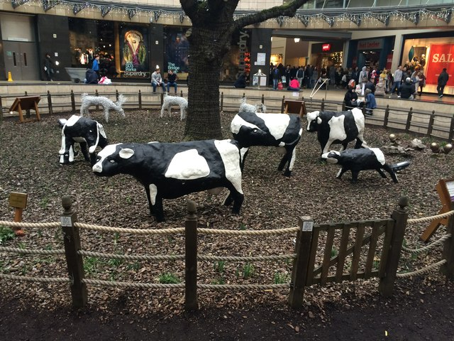
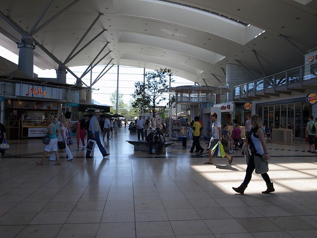

= Geography homework by Ruben Mazziotta

== Ten reasons why Milton Keynes is a sustainable city

. MK has many roundabouts which reduce the amount of traffic. Traffic jams generate tons of CO2 due to motor vehicles still being active

. MK has a massive recycling centre  which has been going on for quite some time

. There are these robots that travel to a locating in MK to delivery a parcel. These are electric powered robots thus less fossil fuels will be burnt

. There is around 270km of red ways. Red ways are road in which cyclers can travel on instead of roads which are quite dangerous

. There are many local farms which means less food will be transported from other countries or parts of the country which means less CO2.

. Milton Keynes centre has shops and jobs close by so less travelling with vehicles needs to be done

. So many parks and trees live in MK. Trees absorb CO2 as a natural process to make food which is known as photosynthesis

. Buses roam the streets of Milton Keynes which in a way is good because buses can transport more people than cars

. Flats are commonly found in MK which reduces the amount of resources and land that has to be used to build more houses

. Wind turbines can be seen in many places of MK which helps abolish the use of fossil fuels

. Concrete cows produce less methane than real cows :)

